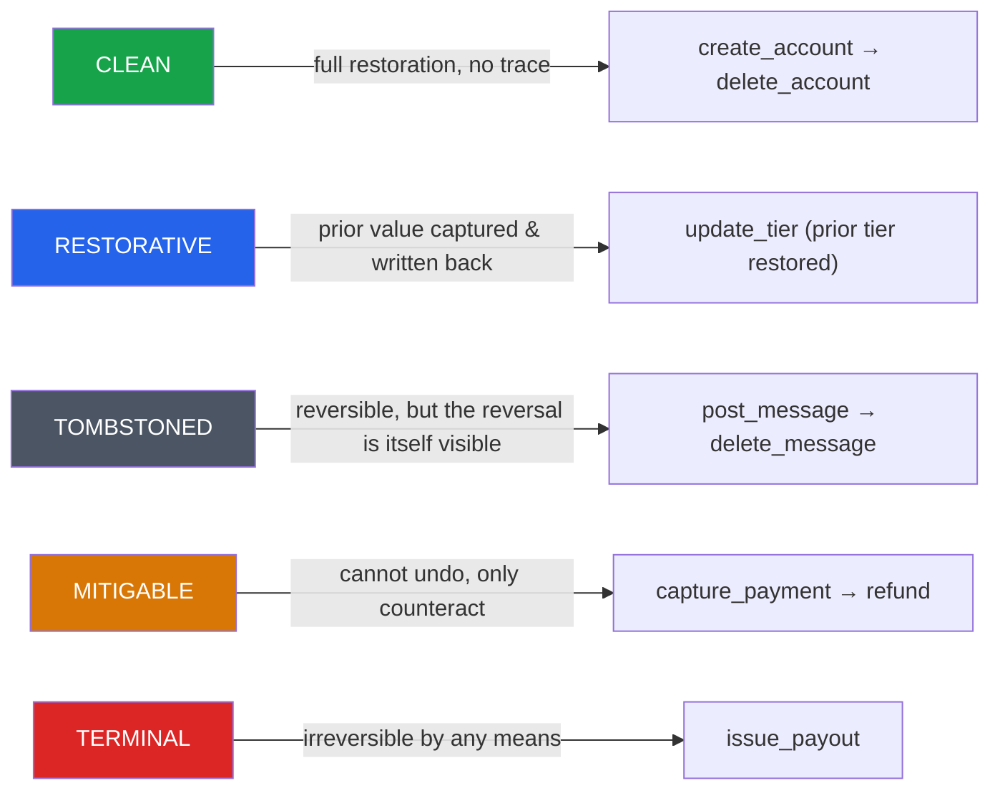
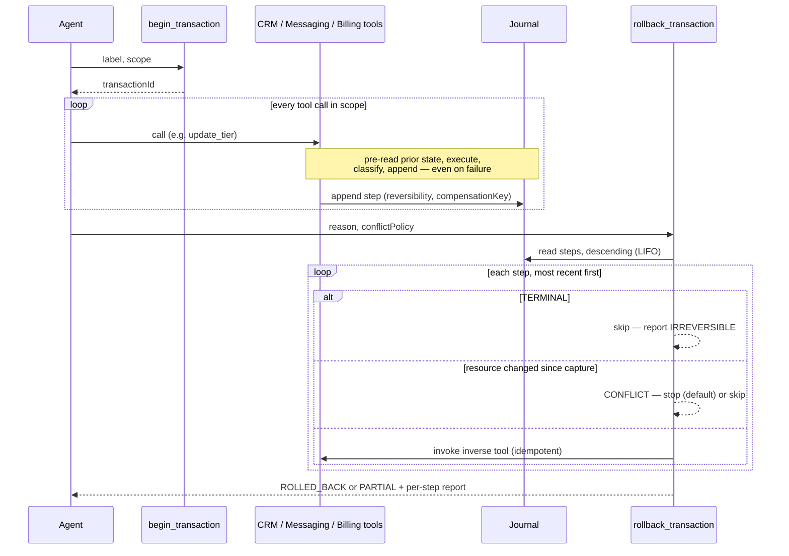

# Reversible Agent Actions

**A transaction boundary for AI agents that write to real systems.**

Give an agent a CRM, a messaging system, and a billing API, and eventually it will do something
it can't take back — mid-plan, after five other steps have already run. This project wraps every
tool call an agent makes inside a journaled, LIFO-reversible transaction, classifies each action
by *how* reversible it actually is, and gives you an honest report — including the parts that
can't be undone — when something needs to be rolled back.

Built as an MCP server on [NitroStack](https://nitrostack.ai), with a live timeline widget and a
7/7-passing acceptance suite.

<p align="center">
  
  
  
</p>

---

## The problem

An agent onboarding a customer might: create a CRM account, upgrade their tier, charge a card,
grant an API key, post a welcome message, send an email, and send an invite — seven calls across
three systems. Step three (the charge) can't be un-charged, only refunded. Step five (the message)
can be deleted, but the deletion itself is visible. If step six fails, what happens to steps one,
two, and four? Silently leaving them in place is wrong. Blindly "rolling back" by pretending
everything is undoable is worse — it's a false promise.

This project treats reversibility as a first-class property of every action, not an afterthought.

## The five-class taxonomy

Every tool call an agent makes gets classified into exactly one of five reversibility classes the
moment it executes:



The first `TERMINAL` step in a transaction is its **pivot** — past that point, the transaction can
never fully roll back, only reach `PARTIAL`, no matter how much of the rest succeeds.

## How a transaction actually rolls back



## Live in the timeline widget

`get_transaction`, `rollback_transaction`, and `preflight_plan` all render an interactive
timeline: a status badge, a right-to-left progress bar while a rollback is in flight, a
scrollable row of step cards (each with its reversibility badge and live compensation state),
a "POINT OF NO RETURN" marker at the pivot, and — only when a rollback actually needs a human —
an amber intervention panel listing exactly what wasn't reversed and what to do about it.

> **Add a screenshot here:** call `get_transaction` on an in-progress rollback in NitroStudio,
> screenshot the rendered widget, and drop it in as `docs/screenshot.png` —
> ``. This is the single highest-leverage thing you can
> add to this README; a live screenshot of five color-coded reversibility badges and a pivot
> marker sells the project in one glance.

## Quick start

```bash
npm install

# Local dev — stdio transport, NitroStudio-ready
npm run dev

# Seed the demo transaction (onboard acme-corp: 7 steps across CRM/messaging/billing)
npm run seed:dev

# Run the acceptance suite (7 scenarios: happy path, conflict detection,
# broken compensator, idempotent rollback, non-owner rejection, ...)
npm run test:acceptance
```

Open the project in [NitroStudio](https://nitrostack.ai/studio), call `begin_transaction`, then
walk through a few writes and `rollback_transaction` to watch the journal unwind live.

## Tool reference

### Transaction boundary

| Tool | What it does |
|---|---|
| `begin_transaction` | Opens a transaction: a label, an actor, and a scope (which systems it may touch). |
| `preflight_plan` | Classifies a proposed plan *before* executing anything — pivot index, reorder suggestion, per-step rationale. Advisory only. |
| `get_transaction` | Journal + reversibility profile for a transaction. Renders the timeline widget. |
| `rollback_transaction` | Compensates every reversible step in strict reverse order. Returns an honest `ROLLED_BACK` / `PARTIAL` report — never throws for a partial result. |
| `commit_transaction` | Closes the boundary. Committed transactions cannot be reversed. |
| `ping` | Unauthenticated health check — uptime, live registered tool count, version. Doubles as the cold-start warm-up target. |

### Target systems (19 tools across 3 servers)

Each one carries a `@Compensatable` spec — its reversibility class, its inverse (if any), and
whether it needs a pre-read to capture prior state before writing.

| Server | Tools |
|---|---|
| **CRM** | `create_account` (CLEAN) · `update_tier` (RESTORATIVE) · `grant_api_key` (CLEAN) · `delete_account` · `revoke_api_key` · `get_account` · `list_accounts` |
| **Messaging** | `post_message` (TOMBSTONED) · `send_email` (MITIGABLE) · `invite_user` (TOMBSTONED) · `delete_message` · `revoke_invite` · `list_messages` |
| **Billing** | `authorize_payment` (CLEAN, decays to MITIGABLE after 7 days) · `capture_payment` (MITIGABLE) · `issue_payout` (**TERMINAL** — `inverse: null`) · `void_authorization` · `refund_payment` · `list_charges` |

### Resources & prompts

| Name | Purpose |
|---|---|
| `registry://compensators` | Every registered tool with its reversibility class, inverse, and manual instruction if irreversible. |
| `registry://taxonomy` | The five-class taxonomy explained, in Markdown. |
| `safe_multi_step_plan` (prompt) | Guides an agent through preflight → open → execute → commit/rollback for any multi-step write operation. |

## Architecture

```
src/
  index.ts                    bootstrap: dual transport, DI wiring, warm-up route
  txn/
    types.ts                  the entire domain vocabulary — nothing else redefines these types
    services/                 journal, transaction lifecycle, registry, classifier, rollback orchestrator
    interceptors/ pipes/      journal every tool call transparently (pre-read → execute → classify → append)
    guards/ filters/          API key + ownership auth, structured error responses
    tools/ resources/ prompts/  the MCP surface
  targets/
    crm/ messaging/ billing/  the three example target systems, each @Compensatable-annotated
widgets/txn-timeline/         the live rollback timeline (Tailwind + React), outside src/ by NitroStack convention
fixtures/
  seed.ts / seed-production.ts   deterministic demo transaction (7 steps, hardcoded compensation keys)
  acceptance-tests.ts             7 scenarios, PASS/FAIL, exit 0/1
```

**Everything is journaled, nothing is assumed reversible by default.** A step with no registered
compensator classifies `TERMINAL` — the safe default is "can't be undone," not "probably fine."

## Deploying

`NODE_ENV=production` switches the server to dual HTTP+stdio transport automatically (binding
`PORT`/`HOST`); see `.env.example` for the full checklist, including why `HOST=0.0.0.0` matters
for a containerized deploy and how the `ping` tool's `/warm`-adjacent health check mitigates
scale-to-zero cold starts.

```bash
npm run build   # tsc + widget bundle
npm start       # nitrostack-cli start — dist/index.js, dual transport
```

